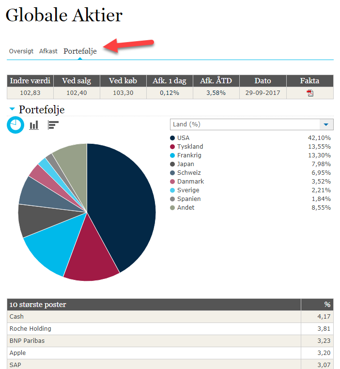
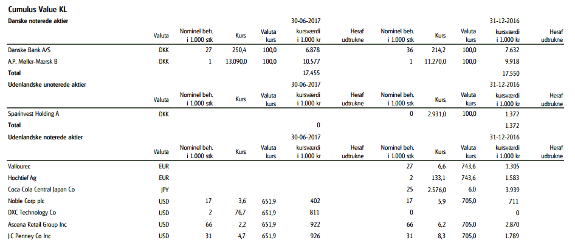

Denmark
==========

1) Source
--------

Main sources are:

* asset manager websites
* Morningstar
* Nasdaq OMX Nordic
* GlobeNewswire Press Releases https://www.globenewswire.com/Index

| Danish Keywords                          | English           |
|------------------------------------------|-------------------|
| Beholding                                | Holdings          |
| Afdelinger                               | funds, our funds  |
| Portefølje                               | Portfolio         |
| Prospekt                                 | Prospectus        |
| Faktaark, Månedsrapport, månedskommentar | factsheet         |
| Central Investorinformation              | KIID              |
| Årsrapport                               | Annual report     |
| Halvårsrapport                           | Semiannual report |

2) Fund reports
--------

The Funds have mainly monthly reports but some reports are quarterly, semiannual or annual. 
Monthly reports are mainly NAV reports.
Mainly the reports are:

* in DKK
* in danish
* you can find the monthly reports mainly on the manager website under Beholding or Portefølje tab

3) Example
--------

1.	**Alm. Brand Invest monthly Funds – NAV reports**

	Click at vis Porteføljen and you can see the full holdings.
	In this case when there is a duplication (two Schindler, Henkel, etc..), or you are unsure, you can use the annual or semiannual report to check the holdings.  

	

2.	**Sparinvest semiannual Funds – NAV reports**

	We can uploaded this report as an NAV report because the position number is divided by 1000, and the Scrubber can not match the positions. 

	
	
| Beholding, Værdipapir   | Holding               |
|-------------------------|-----------------------|
| Antal                   | Quantity              |
| Markedsverdi, Kursværdi | Market value          |
| Formue                  | Total Value/Fund size |

**Position types**
	
| Add    | Don't add              |
|--------|------------------------|
| Aktier | Realkreditobligationer |

4) Fund characteristics
--------

Most publications are Danish, but it is easy to identify the manager and the strategy. The type of the funds are mainly Open End. 
 
Vocabulary here.

If you are using reports from Nasdaq OMX Nordic, there are full holdings in NAV available there. You can find fund size on own website/factsheet(faktaark) or on morningstar. 
When pasting the holdings in excel it puts everything in collumn A, you can use Norway One Collumn macro (MQ addin – EMEA) to make editing the report easier. The macro deletes all rows that are not needed (country, industry) and places the value percentages in collumn B next to the name, it also sets it in the correct format.

5) Fund changes
--------

You can often find information about mergers, name changes, liquidation and other types of fund changes on GlobeNewswire. You can search by fundname or by ISIN as well. Sometimes you can even find reports there.

